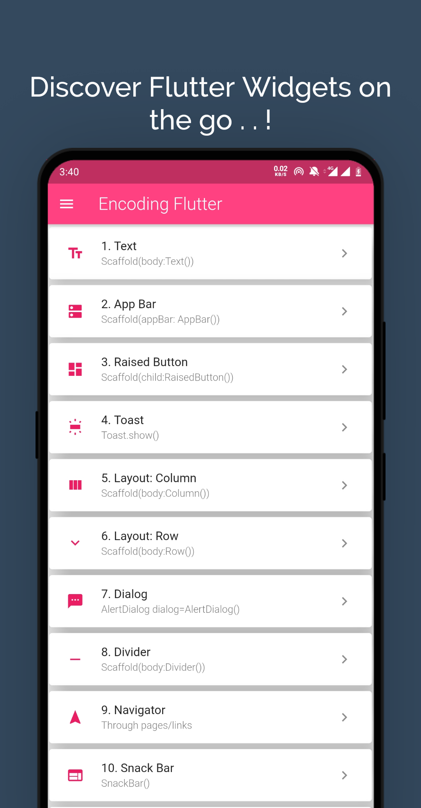
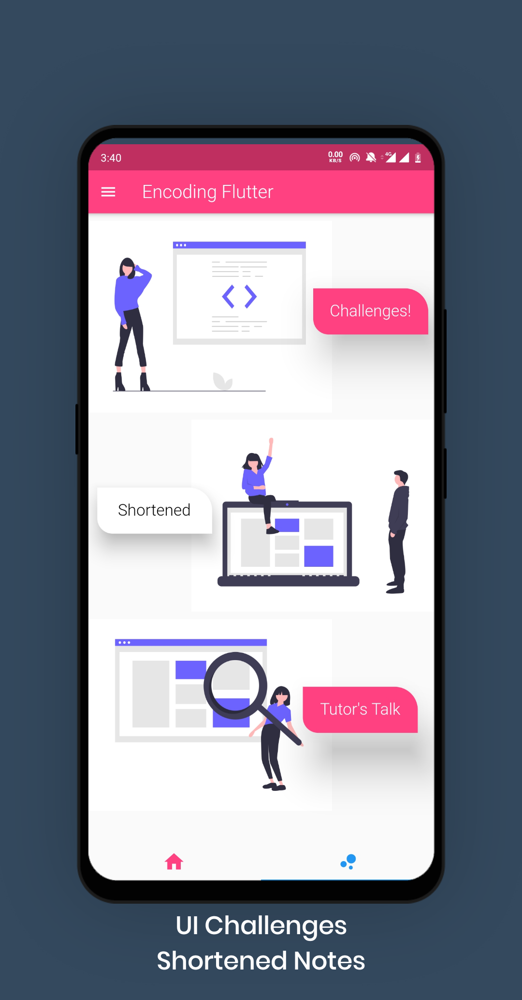
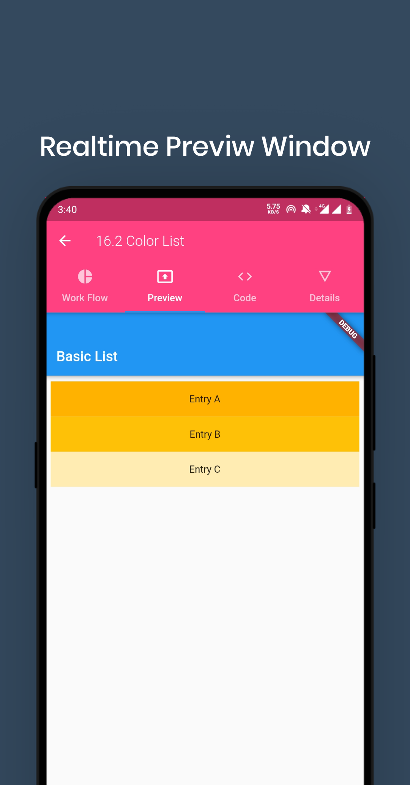
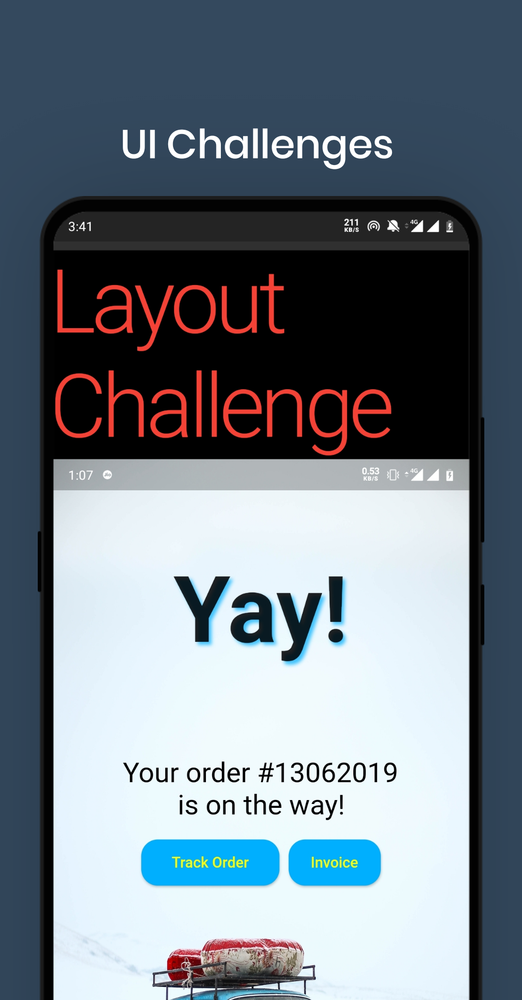
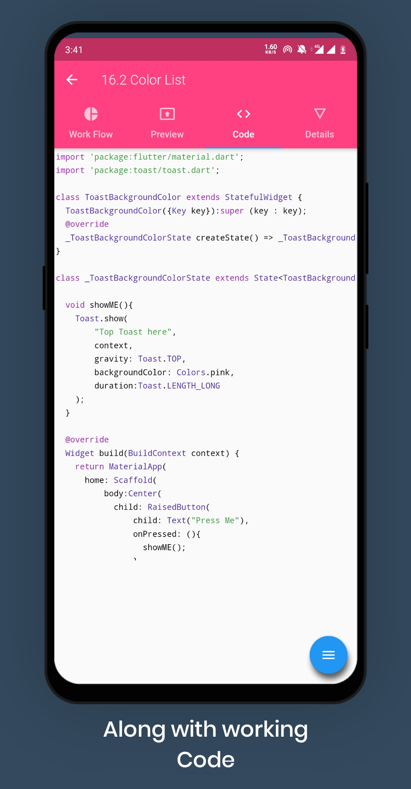
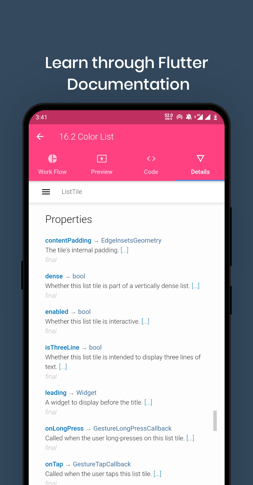
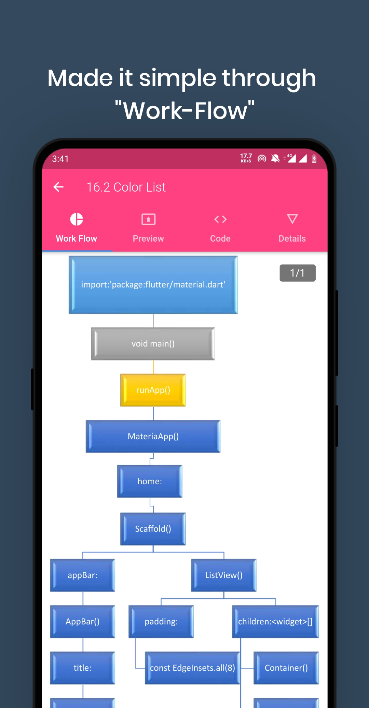
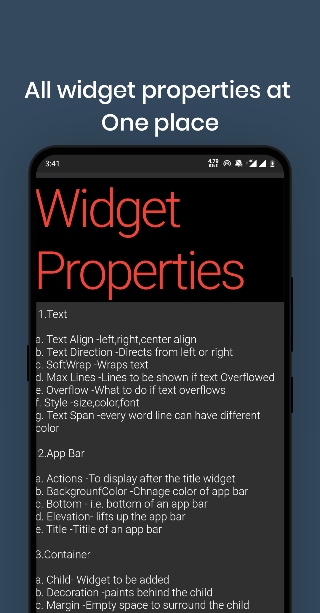

# Encoding Flutter

It's a Flutter Widget Guide Application

## Installation


```
Run main.dart file
```

## Features 

```
1. Source Code
2. Preview
3. Flow Chart
4. Shortened Widget list
5. Tutor's Talk
6. Flutter Doc's
```
## Screenshots
       

## Contributing
Pull requests are welcome. For major changes, please open an issue first to discuss what you would like to change.

Please make sure to update tests as appropriate.
